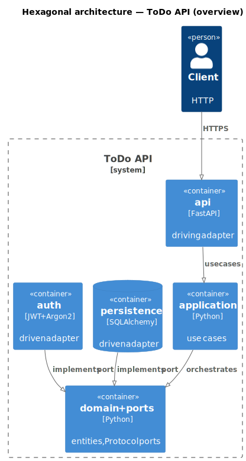
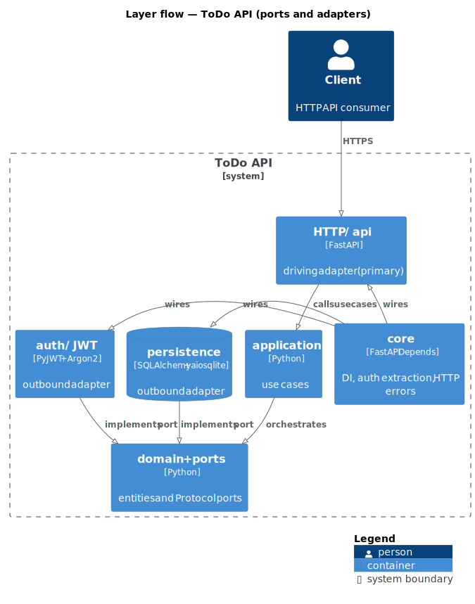
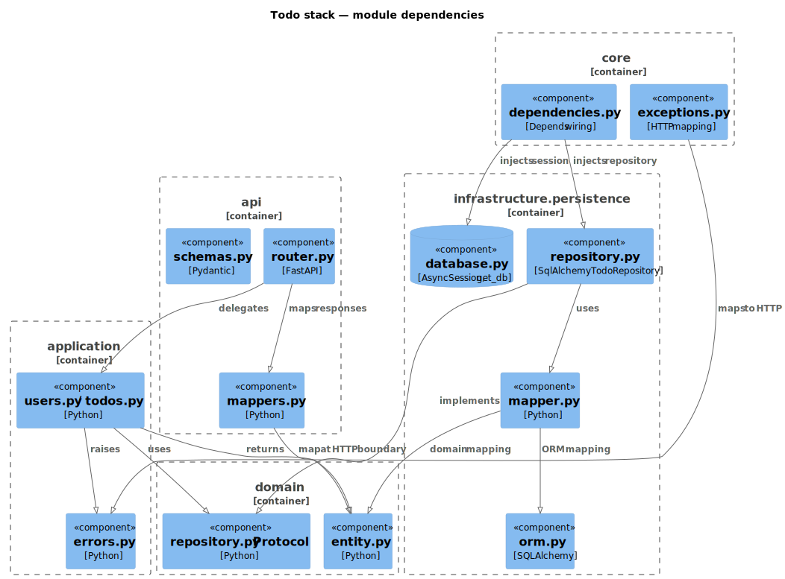
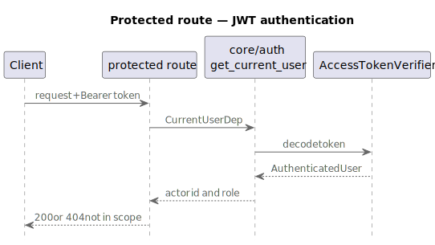

# Architecture

Layered design for ToDo API. Read before structural/feature changes.

**See also:** [Getting started](getting-started.md) · [Database](database.md) · [Authentication](authentication.md) · [API](api.md) · [Development](development.md)

## Overview

**Ports-and-adapters** (hexagonal / clean):

- **Domain** — business meaning; no FastAPI/SQLAlchemy
- **Application** — use cases; domain + ports; no FastAPI/Pydantic
- **Infrastructure** — port implementations (DB, APIs, queues)
- **API** — HTTP + Pydantic at the edge
- **Core** — logging, `Depends`, exception translation

Dependencies point **inward**.

### Diagrams

PlantUML + C4 under [`docs/diagram/`](diagram/); SVGs in [`docs/images/`](images/).

**Prereqs:** Java 17+, `plantuml` + graphviz (or `tools/plantuml.jar`). SVGs pre-committed — regen optional.

```bash
chmod +x scripts/render_diagrams.sh   # once
./scripts/render_diagrams.sh
```

Commit `.puml` + `.svg` when diagrams change.

 — [`hexagonal_overview.puml`](diagram/hexagonal_overview.puml)

**Layer flow:** domain + ports at center; application orchestrates; HTTP/api is driving adapter. Persistence/auth/JWT are driven adapters (implement ports, not next in call chain). Core = `Depends`, auth extraction, exception→HTTP.

 — [`layer_containers.puml`](diagram/layer_containers.puml)

 — [`todo_stack_components.puml`](diagram/todo_stack_components.puml)

## Three kinds of model

Do not merge into one `models.py`:

| Kind | Location | Purpose | Example |
|------|----------|---------|---------|
| **API schema** | `api/<feature>/schemas.py` | HTTP contract | `TodoCreate`, `TodoResponse` |
| **Domain entity** | `domain/<feature>/entity.py` | Framework-free data | `Todo` dataclass |
| **ORM** | `infrastructure/persistence/<feature>/orm.py` | Table mapping | `TodoModel` |

Mapping at boundaries:

- **ORM ↔ domain:** `infrastructure/persistence/<feature>/mapper.py`
- **Domain ↔ API:** router or `api/<feature>/mappers.py`

### Identifiers (UUID v7)

PKs: `uuid.UUID` via `uuid.uuid7()` (Python 3.14+). Helpers in [`domain/ids.py`](../src/todos_app/domain/ids.py):

- `new_id()` — repository `add()` when `entity.id is None`
- `JANE_USER_ID`, `ADMIN_USER_ID`, `SEED_TODO_IDS` — seed SQL, `api.http`, docs

Keyset pagination: `ORDER BY id`, `WHERE id > last_id`. JWT `sub` = `str(user_id)`; verifier parses to `UUID`.

## Repository ports and adapters

Ports = `typing.Protocol` in domain:

```python
# domain/todos/repository.py
class TodoRepository(Protocol):
    async def list_page(
        self, last_id: UUID | None, limit: int, *, owner_id: UUID | None = None
    ) -> TodoPage: ...
    async def get_by_id(self, todo_id: UUID, *, owner_id: UUID | None = None) -> Todo | None: ...
    async def update(self, todo: Todo, *, owner_id: UUID | None = None) -> Todo | None: ...
    async def delete(self, todo_id: UUID, *, owner_id: UUID | None = None) -> bool: ...
    # ...
```

**`owner_id` scope:** optional on todo port methods. Set (regular users) → SQL restricted to actor's rows. `None` (admins) → no owner predicate. Routes pass `list_owner_filter(actor_id, actor_role)` from `domain/auth/authorization.py` — repo does not read JWT/roles. Apply on **reads and writes** (`get_by_id`, `list_page`, `update`, `delete`).

Adapters in infrastructure:

```python
# infrastructure/persistence/todos/repository.py
class SqlAlchemyTodoRepository:
    def __init__(self, db: AsyncSession) -> None: ...
    async def list_page(
        self, last_id: UUID | None, limit: int, *, owner_id: UUID | None = None
    ) -> TodoPage: ...
    # ...
```

Routes/use cases depend on `TodoRepository`, not `SqlAlchemyTodoRepository`.

## Application layer

`application/` — framework-free use cases: orchestrate domain + ports, return entities, raise app/domain exceptions.

| Piece | Role |
|-------|------|
| `application/auth.py` | Login: lookup, verify, token |
| `application/errors.py` | `UserNotFoundError`, `TodoNotFoundError`, etc. |
| `application/users.py` | User CRUD |
| `application/todos.py` | Actor-scoped todo get/update/delete |

Ports as args (`repo: UserRepository`). No FastAPI, Pydantic, or `api/*`. HTTP strings in `core/http_errors.py`; mapping in [`core/exceptions.py`](../src/todos_app/core/exceptions.py).

Routers thin: Pydantic parse → `mappers.py` → use case → response schema.

## Infrastructure layer

Adapters talk to external systems. Domain defines ports; infrastructure implements.

Organize by **system kind**, feature subfolders inside (mirror `domain/<feature>/`).

### Subpackages

| Subpackage | When | Examples |
|------------|------|----------|
| `persistence/` | Durable storage | SQLAlchemy/asyncpg, repos, seeding |
| `messaging/` | Events/messages | RabbitMQ, SQS, outbox |
| `integrations/` | Third-party HTTP | Payments, webhooks |
| `notifications/` | Outbound alerts | SMTP, Slack |
| `cache/` | Ephemeral lookups | Redis adapter |
| `auth/` | External identity | Argon2, JWT |

Create subpackage only when adapters exist — no empty placeholders.

### Not infrastructure

| Location | Holds |
|----------|-------|
| `domain/` | Entities + port Protocols |
| `application/` | Use-case orchestration |
| `api/` | Routes + Pydantic |
| `core/` | Logging, `Depends`, handlers |

### `persistence/` here

PostgreSQL via asyncpg; **`postgres.url`** (`POSTGRES_URL`).

| Piece | Role |
|-------|------|
| Driver URL | `postgresql+asyncpg://…` in profile |
| `database.py` | Engine, `get_db`, `import_all_orm_models` |
| `migrations.py` | `run_migrations_async()` |
| `<feature>/` | `orm.py`, `mapper.py`, `repository.py` |
| `seeding/` | TRUNCATE, migrate, bundled `.sql` |
| `alembic/` | DDL revisions |
| Compose files | Infra (A/B) + app (B/C) |

Deps: `sqlalchemy`, `asyncpg`, `greenlet`. `require_async_db_driver` before engine. Async only in repos/routes.

Tests: PostgreSQL test DB ([`conftest.py`](../../tests/conftest.py), `ENV_PROFILE=test`); no Compose volumes.

**Transactions:** `get_db` commits on success, rolls back on error. Repos stage (`execute`, `add`, `flush`) — no `commit()`.

Beyond single DB (e.g. S3): sibling under `persistence/` or new subpackage.

### `cache/` here

Valkey **required** for auth identity cache.

| Piece | Role |
|-------|------|
| `VALKEY_URL` | From profile |
| `user_auth_cache_codec.py` | `AuthenticatedUser` JSON |
| `valkey_client.py` | Driver guard + client |
| `valkey_user_auth_cache.py` | `UserAuthCache` adapter |

Port: [`domain/auth/user_auth_cache.py`](../src/todos_app/domain/auth/user_auth_cache.py). Wired via `UserAuthCacheDep`; `get_current_user` cache-aside; invalidation on user mutations.

Tests: `FakeUserAuthCache` ([`tests/fakes/`](../../tests/fakes/)), autouse in conftest.

Import style: lazy driver in `valkey_client.py`; `TYPE_CHECKING` in `valkey_user_auth_cache.py`. [Development — type-only imports](development.md#type-only-imports-and-lazy-driver-loading).

### Wiring

Concrete classes built in **`core/dependencies.py`** — routes use port `*Dep`, not `AsyncSession`.

## Dependency injection

All providers in [`core/dependencies.py`](../src/todos_app/core/dependencies.py):

1. `DbSessionDep = Annotated[AsyncSession, Depends(get_db)]`
2. Factory: `DbSessionDep` → port impl
3. `Annotated` alias: `TodoRepositoryDep`

```python
from typing import Annotated
from fastapi import Depends
from sqlalchemy.ext.asyncio import AsyncSession

from todos_app.infrastructure.persistence.database import get_db

DbSessionDep = Annotated[AsyncSession, Depends(get_db)]

def get_todo_repository(db: DbSessionDep) -> TodoRepository:
    return SqlAlchemyTodoRepository(db)

TodoRepositoryDep = Annotated[TodoRepository, Depends(get_todo_repository)]
```

### Route example

```python
from fastapi import Query

from todos_app.core.settings import get_settings

settings = get_settings()

@router.get("", response_model=TodoListResponse)
async def list_todos(
    repo: TodoRepositoryDep,
    current_user: CurrentUserDep,
    last_id: UUID | None = Query(None),
    limit: int = Query(
        settings.api.pagination_default_limit,
        ge=1,
        le=settings.api.pagination_max_limit,
    ),
) -> TodoListResponse:
    owner_filter = list_owner_filter(
        actor_id=current_user.user_id, actor_role=current_user.role
    )
    page = await repo.list_page(last_id, limit, owner_id=owner_filter)
    return TodoListResponse(
        items=[...],  # map page.items to TodoResponse
        next_last_id=page.next_last_id,
        limit=limit,
    )
```

New features: add `get_*_repository` + `*Dep` in `dependencies.py`.

## Configuration and secrets

Stacked TOML under [`config/`](../config/):

| Piece | Role |
|-------|------|
| [`schema.py`](../src/todos_app/core/config/schema.py) | `EnvSettings` + nested groups; all required |
| [`base.toml`](../config/base.toml) | Defaults; merged every profile |
| [`profiles/example.toml`](../config/profiles/example.toml) | Local template → `local.toml` |
| [`profiles/test.toml`](../config/profiles/test.toml) | CI/pytest |
| [`profiles/production.example.toml`](../config/profiles/production.example.toml) | Prod template |
| [`loader.py`](../src/todos_app/core/config/loader.py) | `ENV_PROFILE` → merge → `get_env_settings()` |
| [`flatten.py`](../src/todos_app/core/config/flatten.py) | `api.port` → `API_PORT`, etc. |
| [`export.py`](../src/todos_app/core/config/export.py) | Dotenv export for shell + Compose |

[`core/settings.py`](../src/todos_app/core/settings.py) re-exports `get_settings()`.

### `ENV_PROFILE`

Must set explicitly — no default. `export ENV_PROFILE=local` merges `base.toml` + `profiles/local.toml`.

```bash
cp config/profiles/example.toml config/profiles/local2.toml
export ENV_PROFILE=local2
```

**Rules:** `^[a-z][a-z0-9_]*$`; `example` reserved; secret overlays gitignored.

**`app_env` vs profile name:** filename selects TOML; runtime behavior (OpenAPI, seed guards, prod URL validation) from `app_env` field (`local`/`staging`/`production`).

Local setup:

```bash
cp config/profiles/example.toml config/profiles/local.toml
export ENV_PROFILE=local
```

Shell scripts and Compose: `python -m todos_app.core.config.export` writes gitignored `.env` via [`load_env.sh`](../scripts/internal/load_env.sh).

**Path B:** `postgres.compose_url`, `valkey.compose_url` in TOML; app sets `TODOS_COMPOSE=1` → resolves as `url`. Exports both host and compose URLs.

**Container port:** app listens **8000** internally; host bind `${COMPOSE_APP_BIND}:${API_PORT}:8000`.

`get_settings()` cached `@lru_cache`; `SettingsDep` in dependencies.

## Authentication (JWT)

Login over user persistence + hashing. Protected routes: `Authorization: Bearer`; owner-or-admin where noted.

 — [`auth_sequence.puml`](diagram/auth_sequence.puml)

| Layer | Piece | Role |
|-------|-------|------|
| API | `api/auth/` | `POST /auth/login` |
| API | `api/todos/`, `api/users/` | `CurrentUserDep`; admin → `require_admin` |
| Application | `auth.py`, `users.py`, `todos.py` | Orchestration |
| Domain | `authenticated_user.py`, `authorization.py` | Actor identity, scope rules |
| Domain | `password_hasher.py`, token issuer/verifier ports | Auth ports |
| Infrastructure | `argon2_*`, `jwt_*` | Adapters |
| Core | `auth.py`, `dependencies.py`, `settings.py` | Bearer, `get_current_user`, JWT config |

**Protected endpoints**

| Method | Path | Rule |
|--------|------|------|
| `GET` | `/todos` | Auth; users: own; admins: all |
| `GET` | `/todos/{id}` | Owner or admin; `404` out of scope |
| `POST` | `/todos` | Users: self; admins: optional `owner_id` |
| `PUT`/`PATCH` | `/todos/{id}` | Owner/admin; `403` if non-admin changes `owner_id` |
| `DELETE` | `/todos/{id}` | Owner/admin |
| `GET`/`PUT`/`PATCH` | `/users/me` | Self |
| `PUT`/`PATCH`/`DELETE` | `/users/{id}` | Admin; soft delete default, `?hard=true` cascades |

401: invalid/missing bearer. Todo 404: missing or out of scope. 403: disallowed action (owner change, admin routes).

PyJWT in `pyproject.toml`. Config: Pydantic `schema.py` (not pydantic-settings dotenv).

## Package layout

```text
src/
└── todos_app/
    ├── main.py
    ├── core/
    │   ├── config/          # TOML loader, schema, export
    │   ├── logging.py
    │   ├── auth.py            # Bearer, get_current_user
    │   ├── settings.py
    │   ├── dependencies.py    # *Dep aliases
    │   ├── http_errors.py
    │   ├── error_responses.py
    │   ├── exceptions.py
    │   └── rate_limiting.py
    ├── application/
    │   ├── auth.py
    │   ├── errors.py
    │   ├── users.py
    │   └── todos.py
    ├── domain/
    │   ├── auth/              # ports, AuthenticatedUser, authorization
    │   ├── todos/             # entity, page, repository port
    │   └── users/
    ├── infrastructure/
    │   ├── auth/
    │   ├── cache/
    │   └── persistence/       # database, migrations, seeding, feature repos
    └── api/
        ├── openapi_responses.py
        ├── auth/, health/, todos/, users/
```

Use cases in `application/`; `api/` maps schemas and delegates.

## Adding a feature

1. **Domain:** `entity.py`, `repository.py` (Protocol)
2. **Infrastructure:** `orm.py`, `mapper.py`, `repository.py`
3. **Dependencies:** `get_*_repository` + `*Dep`
4. **Application:** use case module; exceptions → `errors.py` + `core/exceptions.py`
5. **API:** router, schemas, mappers; include in `main.py`
6. No SQLAlchemy/infra imports in domain, application, or route handlers

## Layer rules (checklist)

- [ ] `domain/` imports nothing from outer layers
- [ ] `application/` no FastAPI/infra imports
- [ ] Exceptions → HTTP in `core/exceptions.py`
- [ ] Routes use `*RepositoryDep`, not `AsyncSession`/ORM
- [ ] Async repos; await in routes/use cases
- [ ] New ports: `Protocol`; adapters under `infrastructure/<kind>/`
- [ ] Actor scope: explicit `owner_id` from `list_owner_filter` on reads **and** writes
- [ ] Schemas in `api/`; entities framework-free
- [ ] DI in `core/dependencies.py`

## Testing

Pytest in **`tests/`** (outside `src/`). Every module: `pytestmark = pytest.mark.unit` or `.integration`.

### Layout

```text
tests/
├── conftest.py              # DB, FakeUserAuthCache, httpx client
├── factories.py
├── fakes/                   # in-memory repos + cache
├── unit/
│   ├── domain/
│   ├── application/
│   ├── api/
│   ├── core/
│   └── infrastructure/
└── integration/
    ├── conftest.py          # truncate users/todos per test
    ├── persistence/
    └── api/
```

| Path | Marker | Purpose |
|------|--------|---------|
| `unit/` | `unit` | Domain, use cases + fakes, mappers, core, infra helpers |
| `integration/` | `integration` | SQLAlchemy repos + HTTP via `httpx` |

Unit tests: `FakeTodoRepository`, `FakeUserRepository`, `FakeUserAuthCache`. Integration API: `register_and_login`, `factories.py`.

### Fixtures ([`conftest.py`](../tests/conftest.py))

- `initialized_db` (session) — drop/recreate `public`, `upgrade head`
- `override_password_hasher` — `FastPasswordHasher`
- `db_session` — per-test session + rollback
- `client` — `httpx.AsyncClient` (module-scoped in `integration/api/`)

Integration autouse: delete `users`/`todos` before each test ([`integration/conftest.py`](../tests/integration/conftest.py)).

Env: `ENV_PROFILE=test` before importing `todos_app`.

Bootstrap: [`tests.sh`](../scripts/quality/tests.sh) recreates infra Postgres if creds mismatch; creates `todos_test`. No Compose volumes.

### Run

```bash
pip install -e ".[dev]"
./scripts/quality/tests.sh
./scripts/quality/tests.sh -m unit
./scripts/quality/tests.sh -m integration
./scripts/quality/tests.sh --coverage
```

90% coverage on `todos_app` (`fail_under` in `pyproject.toml`).

Prefer unit for orchestration/domain; integration for SQLAlchemy + HTTP contracts.

### GWT naming

- Name: `test_given_{pre}_when_{action}_then_{outcome}`
- Body: `# given`, `# when`, `# then`
- One behavior per test; parametrized OK
- Exception: failing call in `# when` inside `pytest.raises`

Benchmark: [test-benchmark.md](test-benchmark.md).

### Local DB reset

[`wipe.sh`](../scripts/database/wipe.sh) → `compose down -v` → `migrate.sh` (optional `seed.sh`).
